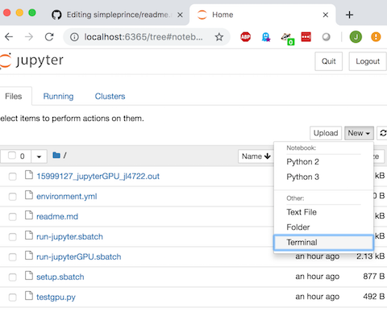

# Simple Prince

## Setup
  1. login to prince ([tutorial](https://wikis.nyu.edu/display/NYUHPC/Logging+in+to+the+NYU+HPC+Clusters))  

  1. once your are in your home folder on prince clone this repo  

      ```bash
      git clone git@github.com:JackLangerman/simpleprince.git
      ```

  2. run `setup.sbatch` as a batch job from the simpleprince folder to setup and install miniconda and setup the ml environment. Feel free to add your favorite packages to [environment.yml](environment.yml) before running this step (you can do it later too).

      ```bash
      cd simpleprince
      sbatch setup.sbatch
      ```


## Running Jupyter

to launch a jupyter notebook on prince (the ml environment exists):

On CPU (what you will want to use most of the time)
```bash
sbatch run-jupyter.sbatch 
```

on GPU (if you need it)
```bash
sbatch run-jupyterGPU.sbatch 
```

Also rembember you can use a jupyter notebook with GPU (or even TPU) for free at [Google Colab](https://colab.research.google.com/)


## Tips and Tricks
  - to check the status of your job and where it is running
      ```bash
      squeue -u YOUR_NET_ID
      ```
  - once you use squeue to check where your job is running you can get a terminal on that machine by SSHing into it ex:

      ```bash
      squeue -u YOUR_NET_ID

      JOBID PARTITION     NAME     USER ST	TIME  NODES NODELIST(REASON)
      15997001     p40_4    setup   jl4722  R	0:18	  1 gpu-52
      ```
      
      we see the job is running on `gpu-52` so we can ssh in using
      
      ```bash
      ssh gpu-52
      ```

  - once you ssh into the machine your job is running on you can monitor gpu status using `watch nvidia-smi` (exit by pressing cntrl-c)


  - add new packages to your environment by putting them in your [environment.yml](environment.yml) file and then calling `conda env update --prune ` from inside the simpleprince folder


  - you can always access your ml environment on prince from any compute job by loading anaconda and then the environment

      ```bash
      module load tensorflow/python3.6/1.5.0
      module swap python3/intel  anaconda3/5.3.1
      source activate ml
      ```

  - to check that GPUs are working in Jupyter:
    1. run a Jupyter GPU notebook after following steps above
    
    1. make a new terminal from Jupyter

        )
    
    1. run the test script
      ```bash
      python ~/simpleprince/testgpu.py
      ``` 
    
    OR from a standard terminal on prince:
      ```bash
      ssh gpu-##
      module load tensorflow/python3.6/1.5.0
      module swap python3/intel  anaconda3/5.3.1
      source activate ml
      ```

#### please feel free to contribute more back to this repo!
